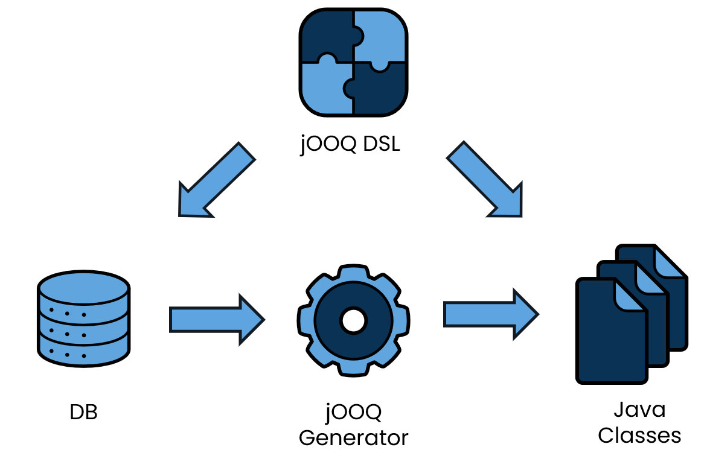
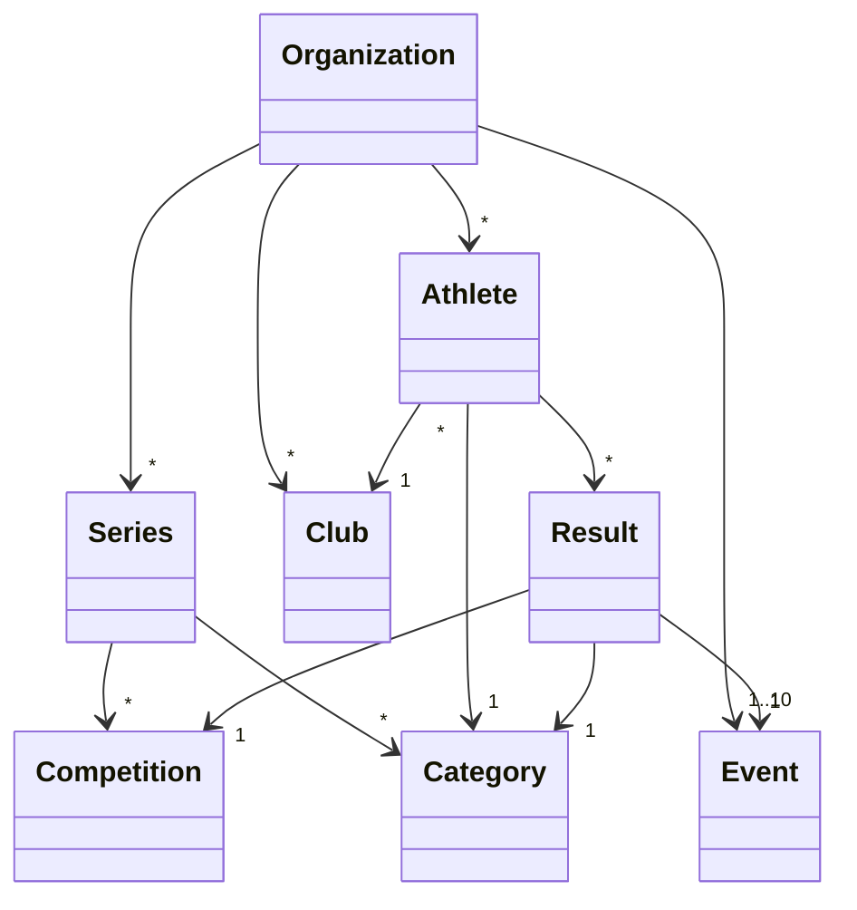

# Vaadin Webinar:  Building data-centric applications with Vaadin and jOOQ

https://pages.vaadin.com/webinar-jooq

## How does jOOQ work?

## Use Case

### Data Model

```mermaid
classDiagram
class Organization
class Series
class Competition
class Club
class Athlete
class Category
class Event
class Result

Organization --> "*" Series
Organization --> "*" Club
Organization --> "*" Athlete
Organization --> "1..10" Event
Series --> "*" Competition
Series --> "*" Category
Athlete --> "1" Club
Athlete "*" --> "1" Category
Result --> "1" Event
Result --> "1" Category
Result --> "1" Competition
Athlete --> "*" Result
```

